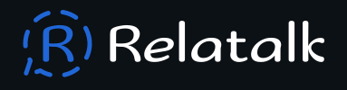

# Relatalk

**Open Source Alternative Social Media Platform**

## What is Relatalk?

Relatalk is an open-source social media platform, relatalk is a community basedq platform, which means, you can choose to join a community, as you would in for discord, If you're feeling like a PRO and want your content in the general base of Relatalk, you can post your thoughts without joining a community.

## Demo

A live version of Relatalk can be found [here](https://relatalk.vercel.app)

## Tech Stack

This project was built with the following.

- Next.js
- MongoDB
- Supabase & Appwrite
- Nodejs & Express

## Contributing

Contributions are always welcome! Here's a few tips on how to get started.

- **Issues**

To get started, please we advise you take a look at the [issues tab](https://github.com/creative-tutorials/app.relatalk/issues), you'll be able to find open issues there that interest you. If you see an issue that interest you, create a new branch and submit a PR for review and approval.

## License

Relatalk is licensed under the [GNU General Public License v3.0](https://choosealicense.com/licenses/gpl-3.0/). Please read the terms the license has to offer before making modification or amendments to the source code or any of its assets.
